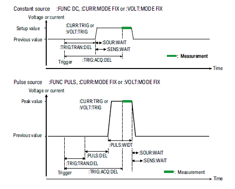

# SMU_CSV Project

##### *All rights reserved Opto Biosystems*
###### *Special Thanks to Scott T Keene, Cambridge University*
<br/>


This project is designed to control a SMU using data points from a csv.

The following lines explains SMU communication syntax:

### Basic commands
```python
serial = 'USB0::0x0957::0xCE18::MY51143745::INSTR'
inst = rm.open_resource(serial)
```
 * defining and connecting to the *inst*rument to use by using a serial. 
 * RM -> Resource Manager, requires pyusb.
<br></br>
```python
inst.write(":sour1:func:mode volt")
```
or
```python
inst.write(":sour1:func:mode curr")
```
* Changes the mode of source output to volt or current.
<br></br>
```python
 inst.write(":sour1:curr:lev:imm 0") 
```
* Changes the output value (here in current mode) to 0. You put the value you are interested in after the imm.
* The mode must have been set ***prior*** to this command. Otherwise, it'll do nothing if the mode of the SMU isn't corresponding to the one mentioned in this command.
<br></br>
```python
inst.write(":outp1 on")
```
or
```python
inst.write(":outp2 on")
```
* This command switches the desired output on (1 or 2).
* It is advised to switch the level (previous command) before switching the output on. You wouldn't want to fry your device.
<br></br>
*let ch1_list, a sweep list of current value you want your output to give*
```python
inst.write(":sour1:list:curr " + ch1_list)
```
* Sets the list sweep output (current or voltage) data for the specified channel.

:exclamation: The sweep list has a specific format :
* float with same format (Example : format everything to 3e -> scientific notation, 3 digits after the coma )
* Each value separated by coma : yes it's a list

<br></br>

```python
inst.write(":sens1:func:on \"curr\"")
```
or
```python
inst.write(":sens2:func:on \"volt\"")
```
* Enables the specified measurement functions.

:question: To check if it worked, use 
```python
inst.query(":sens1:func?")
```
<br></br>
```python
inst.write(":sens2:curr:rang:auto on")
```
* Enables or disables the automatic ranging function of the specified measurement
channel.

***N.B.*** This is used on both sens and source
<br></br>
```python
inst.write(":sens1:curr:prot 0.4")
```
*Sets the compliance value of the specified channel. The setting value is applied to both positive and negative sides.

***N.B. 1*** This is used on both sens and source

***N.B. 2*** You can specify a different maximum and minimum using :
```python
inst.write(":sens1:curr:prot:neg 0.4")
inst.write(":sens1:curr:prot:pos 0.6")
```
:exclamation: I would advise you to set this after the immediate value of your output and before turning the output on. You can never be too sure.
<br><br/>
```python
inst.write(":sens1:volt:rang 2")
```
* If the automatic ranging function is disabled, this command sets it to 2V : 0 ≤ |V| ≤ 2.12 V.

***N.B.*** This is used on both sens and source
<br><br/>
```python
inst.write(":sens1:wait off")
inst.write(":sour1:wait off")
```
* Measurement wait set to off.

*Illustration of wait function from Keysight Technologies B2900 Series
Source/Measure Unit command reference*


